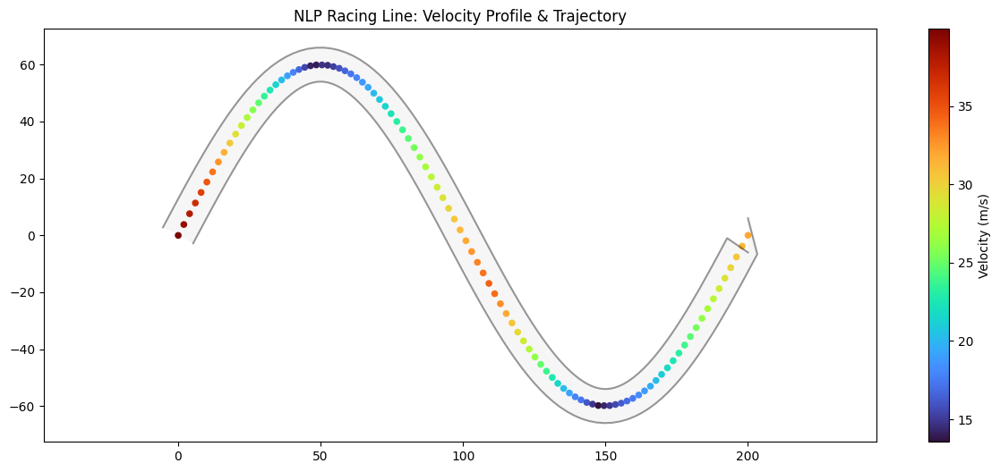
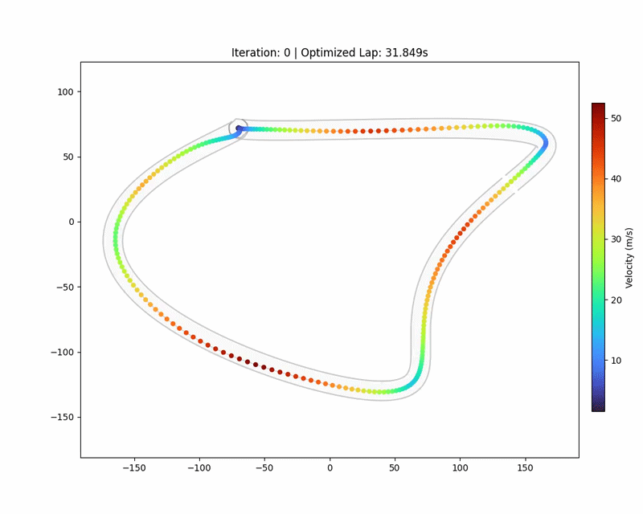

# Racing Line Optimization: NLP vs. Heuristic Swarm Intelligence

An engineering project focused on computing optimal autonomous racing trajectories by minimizing lap time under vehicle dynamics and track boundary constraints.
### Technical Report
[View the Full Technical Report (PDF)](./assets/NLP.pdf)

## Project Overview
This repository explores three distinct methodologies for solving the "Racing Line" problem—finding the path that balances the shortest distance with the maximum possible cornering speed.

### 1. [V1] Basic Nonlinear Programming (NLP)
The original implementation formulating the racing line as a constrained optimization problem.
* **Solver:** SLSQP (Sequential Least Squares Quadratic Programming).
* **Focus:** Geometric path optimization and basic lateral acceleration limits.

### 2. [V2] High-Fidelity NLP (Professional Grade)
An upgraded version of the NLP solver that incorporates advanced vehicle dynamics.
* **Menger Curvature:** Numerical calculation of 1/R for arbitrary track geometries.
* **Longitudinal Dynamics:** Bi-directional velocity pass to model engine acceleration and braking limits.
* **Variable Friction:** Implementation of track marbles where friction coefficients drop at the track edges.
* **Objective:** Minimizes total time ($\int \frac{1}{v} ds$) rather than just path length.


### 3. [V3] Particle Swarm Optimization (PSO)
A heuristic, ML style approach to path discovery.
* **Methodology:** A swarm of 60+ particles explores lateral offsets across 20+ track sectors.
* **Stochastic Search:** Finds global minima in non-convex cost landscapes where gradient-based solvers might struggle.
* **Visualization:** Shows the real-time learning process as the swarm converges on the optimal apex.

## 🛠️ Installation & Usage
1. Clone the repo:
   ```bash
   git clone [https://github.com/Nimmi-Giji/rlo.git](https://github.com/Nimmi-Giji/rlo.git)
2. Install dependencies
    ``` bash
    pip install -r requirements.txt
    ```
3. Run the code

##  Results

### V1  Basic NLP (SLSQP)

| Metric | Value |
|---|---|
| Optimal Radius | 14.9899 m |
| Velocity | 100.0 m/s |
| Optimal Lap Time | 10.0015 s |
| Max Lateral Acceleration | 43.98 m/s² |

### V2  High-Fidelity NLP (SLSQP)

| Metric | Value |
|---|---|
| Initial Lap Time | 19.919 s |
| Optimized Lap Time | 19.658 s |
| Time Improvement | 0.261 s (1.3%) |
| Max Velocity | 39.94 m/s (143.8 km/h) |
| Min Velocity | 13.55 m/s (48.8 km/h) |
| Average Velocity | 24.50 m/s |

### Optimization Comparison

| Aspect | SLSQP (NLP) | PSO |
|---|---|---|
| Optimization Type | Gradient-based | Swarm / heuristic |
| Convergence Speed | Fast | Slower |
| Smooth Trajectory | Excellent | Moderate |
| Global Search Ability | Limited | Strong |
| Sensitivity to Initial Guess | High | Low |
| Best Use Case | Refinement | Exploration |